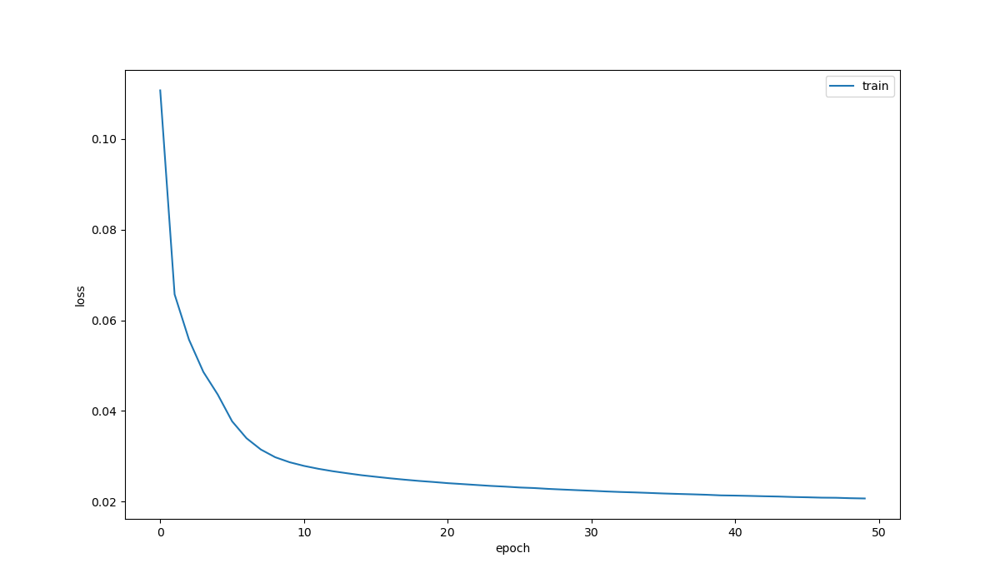
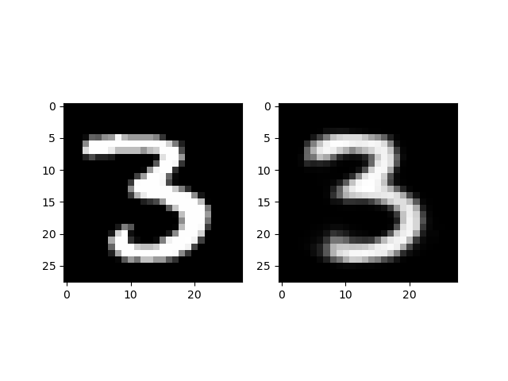
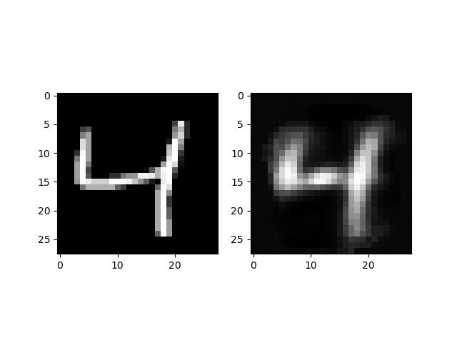
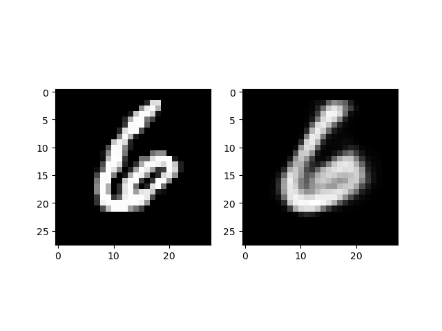
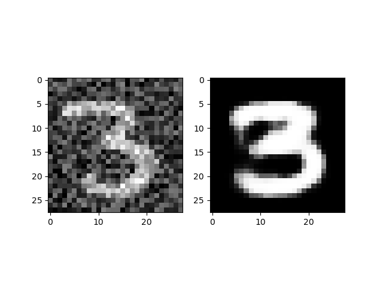
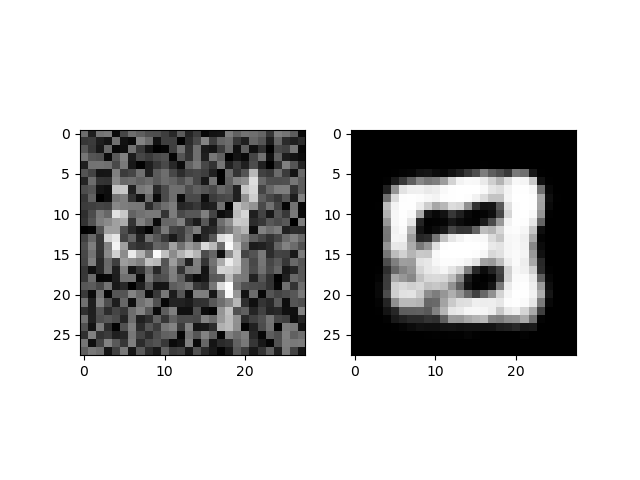
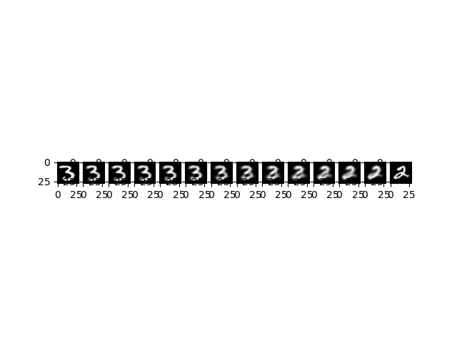
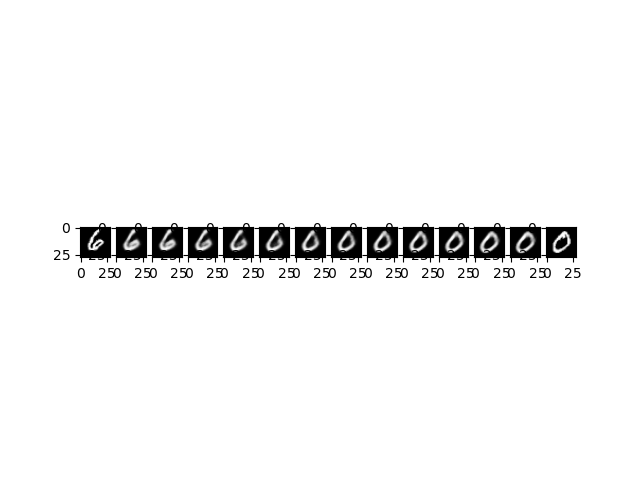

# ELEC475 Lab 1
By Jacob Chisholm, 20335775

## Model Details
The model in this program creates an MLP Autoencoder with equal size input and output layers.
In this model, there are two layers present before and two layers present after the bottleneck layer for a total of four layers.
The Rectified Linear Unit (ReLU) activation function is used inbetween all layers.
The following is a structual depiction of the model with layer widths.

```
Input Layer (784 -> 392)
        |
      ReLU
        |
Mid Layer 1 (392 -> 8)
        |
      ReLU
        |
Mid Layer 2 (8 -> 392)
        |
      ReLU
        |
Output Layer (392 -> 784)
```

## Model Training
Model training was performed using the ADAM optimizer and a scheduler that reduces the learning rate when the loss function plateaus.
The specific name of this scheduler in PyTorch is `ReduceLROnPlateau`.
The loss function used was the Mean Square Error (MSE) of pixel value differences.


In training, a CUDA capable GPU was used to accelerate the process.
The model was trained in 50 epochs over 4 minutes and 28 seconds, achieving an MSE loss of 0.0207.

The loss during training is shown below.




## Results
As seen in the above image, training loss starts above 10% and quicky decreases before settling in at around 2%.
As with most model training, a pattern similar to exponential decay is expected.

With a MSE of only 2%, one might expect the reconstructed image to closely resemble the original.
However, in examining the output images, there are some major differences.
For example, the reconstructed images appear to have less refined edges than the original.

### Decoded Images
The original images are pictured on the left while the reconstructed images are on the right.





Note that the images are less sharpened and in some cases, deformed.

### Image Denoising
The original images with noise added are pictured on the left.
Denoised images are pictured on the right.



Note that in some cases, like the following, removing noise results in complete deformation of the image. 



### Bottleneck Interpolation
Bottleneck interpolation was performed through a linear interpolation between the bottlenecks of two images.
The results are pictured below.




